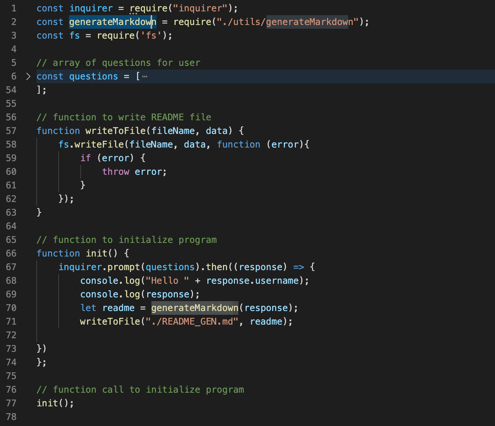
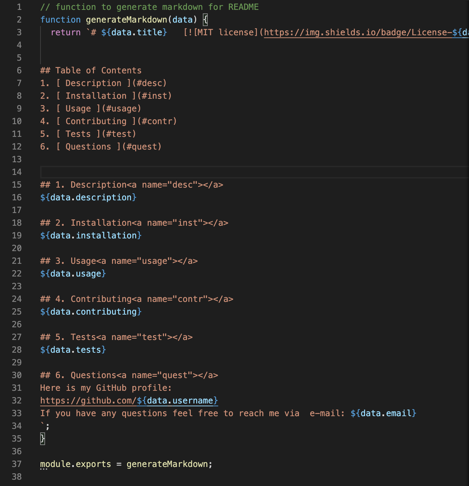

# ReadMe Generator 

## Table of Contents
1. [ Description ](#desc)
2. [ Task ](#task)
3. [ Link to screen recording ](#link)
4. [ Structure ](#structure)
5. [ Finished product ](#final)

## 1. Description
This repository contains code for the application that allows to generate ReadMe file. 

## 2. Task
task is to create a command-line application that dynamically generates a professional README.md file from a user's input using the Inquirer package.
This allows the project creator to devote more time to working on the project.
The high-quality README should include what the app is for, how to use the app, how to install it, how to report issues, and how to make contributions. 

## 3. Link to screen recording
Screen recording capturing how the file is generated:  

## 4. Structure
The folder contains  *.json* pacakage, node_modules, two *.js* files, finished product and supplemental media.
*index.js* file contains the code with questions, functions to initialize the program and write the file, and require() method calls to load and cache "inquirer", "fs" modules, and generateMarkdown function.

*generateMarkdown.js* contains the function to generate the markdown file.               

## 5. Finished product
The generated ReadMe file is located in the root of this folder: [Link](README_GEN.md).

